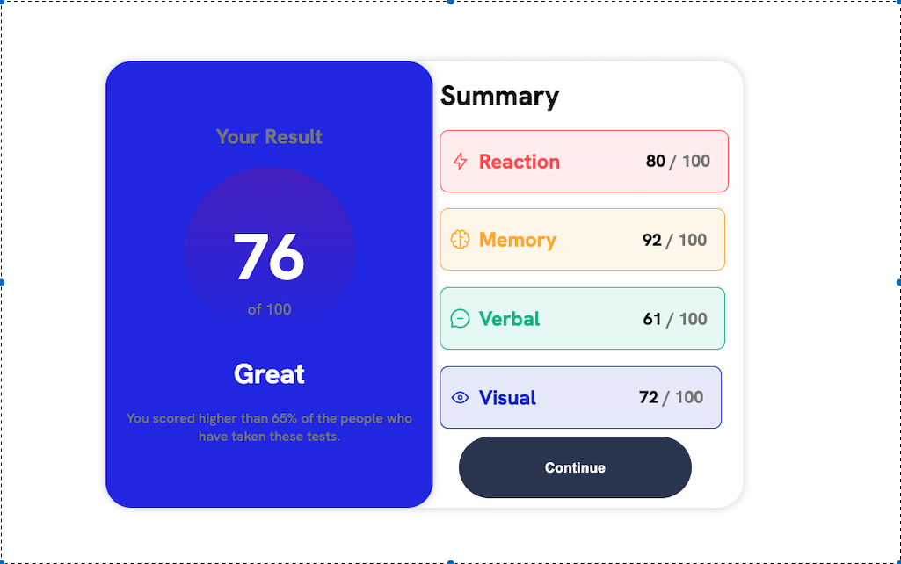

# Results summary component solution

This is a solution to the [Results summary component challenge on Frontend Mentor](https://www.frontendmentor.io/challenges/results-summary-component-CE_K6s0maV). Frontend Mentor challenges help you improve your coding skills by building realistic projects. 

## Table of contents

- [Overview](#overview)
  - [The challenge](#the-challenge)
  - [Screenshot](#screenshot)
  - [Links](#links)
- [My process](#my-process)
  - [Built with](#built-with)
  - [What I learned](#what-i-learned)
  - [Continued development](#continued-development)
  - [Useful resources](#useful-resources)
- [Author](#author)
- [Acknowledgments](#acknowledgments)


## Overview
  Results summary component is a website that shows the results of a survey. It is a simple website that is easy to navigate and understand. It is a website that is responsive and can be viewed on any device.
### The challenge

Users should be able to:

- View the optimal layout for the interface depending on their device's screen size []
- See hover and focus states for all interactive elements on the page []

### Screenshot



### Links

- Solution URL: [Here is the link to our solution on Github](https://github.com/UbaidRussell/Results-summary-component) 
- Live Site URL: [Check the site out and see the live version here 🤍](https://ubaidrussell.com/Results-summary-component/)

## My process

### Built with

- Semantic HTML5 markup
- CSS custom properties
- Flexbox


### What I learned

Before this project I have never used linear-gradient and I find it has been cool to give a space or area two different colors

```css
    background-image: linear-gradient(hsla(256, 72%, 46%, 1),hsla(241, 72%, 46%, 0));
```

### Continued development
 
We intend to continue working on beautiful elegant websites that come alive

### Useful resources

- [Example resource 1](https://www.w3schools.com/CSSref/func_linear-gradient.php) - This website by W3schools has helped me make the linear gradient you see in the circle on the left sided card and has proved to be extremely helpful.

## Author

- Website - [UbaidRussell](https://ubaidrussell.com/)
- Frontend Mentor - [@UbaidRussell](https://www.frontendmentor.io/profile/ubaidrussell)
- Twitter - [@UbaidRussell](https://www.twitter.com/ubaidrussell)

## Acknowledgments
Shout out to w3schools for helping me make this website come alive. 
